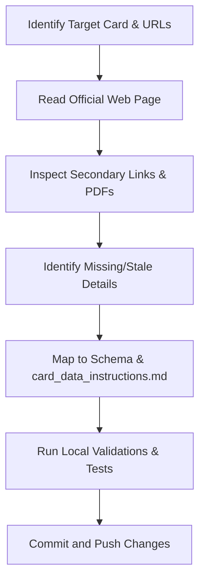

# Verify Card Details From Official Web

Use this skill to audit existing credit cards or ingest new ones by systematically parsing official bank pages and PDFs.

## Workflow



### Step 1: Read the Official Web Page
- Identify the canonical product page URL from the card's `sourceUrl` property in the JSON file.
- Use reading tools (e.g., `read_url_content` or `read_browser_page`) to fetch the page content.
- Capture the high-level features: joining/annual fees, welcome benefits, baseline rewards, domestic/international lounge access, golf games, and milestone benefits.

### Step 2: Go Through All Links & Secondary Documents
Official pages often hide critical restrictions, caps, or devaluations in linked terms & conditions PDFs or schedule of charges sheets.
- Scan the fetched webpage text for links to:
  * **Terms and Conditions (T&Cs)** or **Most Important Terms & Conditions (MITC)**
  * **Schedule of Charges / Tariff Sheet**
  * **Rewards Program Terms / Redemption Portal Rules**
  * **Lounge Program Terms** or **Golf Booking Terms**
- Fetch or search these files to find recent changes or hidden limits.

### Step 3: Find Missing or New Details
Compare the retrieved details against the current card entry in the issuer's JSON file (`data/cards/<issuer>.json`). Look specifically for:
- **Rewards Capping**: Limits on specific categories (e.g., monthly limits on grocery, utilities, insurance, or rent).
- **Lounge Spends Requirements**: Spend-based lounge unlock criteria (e.g., spending ₹35,000 in the previous quarter to unlock the next quarter's lounge access).
- **Golf Privileges**: Restrictions on the number of games/lessons, booking slots, and cancellation window policies.
- **Redemption Partners**: Point transfer ratios and Turnaround Time (TAT) to airline or hotel loyalty programs.
- **Exclusions**: Specific merchant categories (MCCs) or transactions that yield 0% rewards (e.g., fuel, rent, insurance, government spends, wallet load).

### Step 4: Map & Update Card Data
Apply the rules specified in [card_data_instructions.md](file:///C:/Users/manpr/Documents/Codex/2026-05-08/i-want-to-build-an-ai/data/cards/card_data_instructions.md) to update the JSON card file:

1. **Exclusions**:
   - Zero-reward categories go into `"exclusions"` (array of strings) and `"exclusionCodes"` (exclusion codes array).
   - If a category is rewarded at a lower rate rather than zero, do NOT add to exclusions. Instead, map it inside the `"rewards"` array.
2. **Additional Perks**:
   - Keep `"additionalBenefits"` and `"additionalDetails"` concise and easy to read.
   - Do NOT duplicate details already structured in other properties (like reward rates or lounge count).
3. **Internal Nuances**:
   - Store low-level program details, cancel/booking conditions, and specific dates in `"internalNotes"` to keep them indexed by Ask AI without cluttering the UI.
   - Mark the review date inside `internalNotes` as:
     `"Card details manually reviewed and verified by user on YYYY-MM-DD"`
4. **Dates & Status**:
   - Set `"lastVerified"` to today's date in `YYYY-MM-DD` format.
   - Set `"verificationStatus"` to `"official-direct"`.

### Step 5: Validate & Run Tests
Always run the validation and testing pipeline after modifying JSON card data:
1. Run card schema validator:
   `powershell -ExecutionPolicy Bypass -Command "npm run validate:cards"`
2. Run TypeScript compiler checks:
   `.\tools\node\node.exe .\node_modules\typescript\bin\tsc --noEmit`
3. Run vitest test suite:
   `powershell -ExecutionPolicy Bypass -Command "npm test"`

### Step 6: Commit & Push
Stage only the modified card configuration and push:
```bash
git add data/cards/<issuer>.json
git commit -m "Update <card name> details from official bank audit"
git push origin main
```

---

## IndusInd Bank Specific Scraping & Auditing Guidelines

When auditing or crawling **IndusInd Bank** cards, use the following directory mapping and scraping strategies:

### 1. Key URLs & Ingestion Targets
- **Listing Page**:
  `https://www.indusind.bank.in/in/en/personal/cards/credit-card.html`
- **Individual Card Pages**:
  Structured as `https://www.indusind.bank.in/in/en/personal/cards/credit-card/<card-id>-credit-card.html`
  - Pioneer Legacy: `pioneer-legacy-credit-card.html`
  - Legend: `legend-credit-card.html`
  - Pinnacle: `pinnacle-credit-card.html`
  - Indulge: `indulge-credit-card.html`
- **General Notice / Revisions Page**:
  This page details recent rewards exclusions and baseline revisions:
  `https://www.indusind.bank.in/in/en/personal/revision-indusInd-bank-credit-card-rewards-program.html`

### 2. Identifying Secondary Notice Assets
IndusInd frequently publishes revisions (like golf clubs lists and lounge access criteria) in standalone PDFs under their corporate media folders.
Scan the main pages or perform targeted queries to locate notices under:
- `https://www.indusind.bank.in/content/dam/indusind-corporate/Other/`
- Key files to look for:
  * `Lounge-Terms-and-Conditions.pdf` (contains spend thresholds and quarter tracking guidelines)
  * `List-of-Club-Revised-2.pdf` (contains golf games and lessons access restrictions)

### 3. Scraping Strategy
- **Client-Side Rendering**: IndusInd pages frequently use dynamic elements or tabbed details (e.g., separating "Benefits" and "Charges" tabs). When using automated readers, trigger full browser page loads (`read_browser_page`) if base HTML lacks the tab contents.
- **CDN Cache Bypassing**: If the page content appears outdated or doesn't reflect a announced devaluation, append a timestamp query parameter (e.g., `?v=1ea25740`) to force fetching directly from the server.

### 4. Extracting and Saving Card Images
- To locate the official card face thumbnail image, search the page content for image paths containing the card name or `creditCard` subfolders (e.g., `/content/dam/indusind-platform-images/productCategory/desktopImage/creditCard/`).
- Use tools or scripts to download the image directly to `public/images/` using a clean name.
  * *Example PowerShell Command:*
    `Invoke-WebRequest -Uri "https://www.indusind.bank.in/content/dam/indusind-platform-images/productCategory/desktopImage/creditCard/th-pioneer-heritage-credit-card1.png" -OutFile "public/images/indusind-pioneer-heritage-metal.png"`
- Add the corresponding `"imageUrl"` attribute to the card's JSON object (e.g., `"imageUrl": "/images/indusind-pioneer-heritage-metal.png"`).

---

## HDFC Bank Specific Scraping & Auditing Guidelines

When auditing or verifying **HDFC Bank** cards, use the following guidelines:

### 1. Key URLs & Ingestion Targets
- **SmartBuy Rewards Portal**:
  `https://offers.smartbuy.hdfcbank.com/` and card-specific transfer pages:
  - Infinia: `https://offers.reward360.in/infinia/miles_transfer`
- **Official Terms & Conditions**:
  Scan for the card's specific Rewards Points Program T&Cs PDF on the official HDFC site:
  - Example: `https://www.hdfc.bank.in/content/dam/hdfcbankpws/in/en/personal-banking/discover-products/cards/credit-cards/infinia-credit-card/rewards-points-program-terms-and-conditions.pdf`

### 2. Points Transfer & Ratios
- **1:1 Partners**: Air France/KLM (Flying Blue), Finnair Plus, AirAsia, Vietnam Airlines (Lotusmiles), IHG One Rewards, Wyndham Rewards, Radisson Rewards.
- **2:1 Partners (100:50)**: Air Canada (Aeroplan), Air India (Maharaja Club), Avianca (LifeMiles), British Airways (Executive Club), Cathay Pacific (Asia Miles), Etihad Guest, Qatar Airways (Privilege Club), Singapore Airlines (KrisFlyer), Thai Airways (Royal Orchid Plus), Turkish Airlines (Miles&Smiles), United (MileagePlus), SpiceJet (SpiceClub), Accor (ALL), Club ITC, Marriott Bonvoy.
- **Turnaround Time (TAT)**: Leave the `tatDays` field undefined in the JSON file if no turnaround time is verified, which triggers the UI to hide the TAT column.
- **Avios Transfer Strategy**: Take note that Finnair Plus converts at 1:1, allowing users to link their Finnair accounts and transfer Avios 1:1 to British Airways or Qatar Airways (which are otherwise direct 2:1 partners from HDFC).
