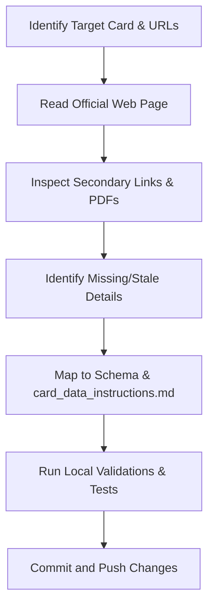

# Verify Card Details From Official Web

Use this skill to audit existing credit cards or ingest new ones by systematically parsing official bank pages and PDFs.

## Workflow



### Step 1: Read the Official Web Page
- Identify the canonical product page URL from the card's `sourceUrl` property in the JSON file.
- Use reading tools (e.g., `read_url_content` or `read_browser_page`) to fetch the page content.
- Capture the high-level features: joining/annual fees, welcome benefits, baseline rewards, domestic/international lounge access, golf games, and milestone benefits.
- Verify the card network variants explicitly from the official product page or terms (for example `Visa`, `Mastercard`, `RuPay`, `American Express`, `Diners Club`). Do not assume all historical or alternate variants are still active just because older pages or cached summaries mention them.

### Step 2: Go Through All Links & Secondary Documents
Official pages often hide critical restrictions, caps, or devaluations in linked terms & conditions PDFs or schedule of charges sheets.
- Scan the fetched webpage text for links to:
  * **Terms and Conditions (T&Cs)** or **Most Important Terms & Conditions (MITC)**
  * **Schedule of Charges / Tariff Sheet**
  * **Rewards Program Terms / Redemption Portal Rules**
  * **Lounge Program Terms** or **Golf Booking Terms**
- Fetch or search these files to find recent changes or hidden limits.

### Step 3: Find Missing or New Details
Compare the retrieved details against the current card entry in its per-card file (`data/cards/<issuer>/<card-id>.json`). Look specifically for:
- **Network Variants**: Confirm the currently offered network(s) and remove stale networks that are no longer shown on the official product page or official documents.
- **Card Image**: Verify that the card has a good `imageUrl` pointing to the actual card face, not a banner, eligibility artwork, or generic marketing visual.
- **Latest Updates**: Check whether the issuer has any recent official updates, revision notices, devaluations, fee changes, lounge-rule changes, reward revisions, or benefit changes that should be added to `data/card-content.json`.
- **Rewards Capping**: Limits on specific categories (e.g., monthly limits on grocery, utilities, insurance, or rent).
- **Lounge Spends Requirements**: Spend-based lounge unlock criteria (e.g., spending ₹35,000 in the previous quarter to unlock the next quarter's lounge access).
- **Golf Privileges**: Restrictions on the number of games/lessons, booking slots, and cancellation window policies.
- **Redemption Partners**: Point transfer ratios and Turnaround Time (TAT) to airline or hotel loyalty programs. If the card transfers to a partner we already have a rupee valuation for (Accor, Club ITC, Marriott Bonvoy), also add a `transferPartnerValuations` entry — see Step 4.
- **Exclusions**: Specific merchant categories (MCCs) or transactions that yield 0% rewards (e.g., fuel, rent, insurance, government spends, wallet load).
- **DCC Markup Fees**: Check for Dynamic Currency Conversion fees (e.g., a 1% markup fee on INR spends processed internationally or at foreign-registered merchants).

### Step 4: Map & Update Card Data
Apply the rules specified in [card_data_instructions.md](file:///C:/Users/manpr/Documents/Codex/2026-05-08/i-want-to-build-an-ai/data/cards/card_data_instructions.md) to update the JSON card file:

Before editing, keep this source-of-truth model in mind:

- `rewards`: earning structure only
- reward-row cap fields: caps tied to those reward rows
- `feeWaiverSpend`: fee waiver only
- `joiningBenefits`: welcome / first-use benefits
- `renewalBenefits`: renewal / anniversary benefits
- `milestoneBenefits`: spend-threshold unlocks only
- lounge fields: lounge counts only
- `redemption`: redemption values and transfer structure only
- `exclusions` + `exclusionCodes`: zero-reward categories only
- `internalNotes`: caveats, dates, booking flow, posting timing, issuer nuance, review notes
- `additionalBenefits`: ongoing perks not already modeled elsewhere
- `additionalDetails`: short support details not already represented elsewhere

If a fact already has a structured home, do not repeat it in visible prose.

1. **Exclusions**:
   - Zero-reward categories go into `"exclusions"` (array of strings) and `"exclusionCodes"` (exclusion codes array).
   - If a category is rewarded at a lower rate rather than zero, do NOT add to exclusions. Instead, map it inside the `"rewards"` array.
2. **Networks**:
   - Update the `"network"` array only from currently verified official issuer sources.
   - Remove stale or legacy network variants unless the official page clearly shows they are still offered for the same card.
   - If issuer materials show multiple active variants, keep only those explicitly supported by the current product page or current official terms.
3. **Additional Perks**:
   - Keep `"additionalBenefits"` and `"additionalDetails"` concise and easy to read.
   - Do NOT duplicate details already structured in other properties (like reward rates or lounge count).
   - Keep annual fee waiver tracking only in the structured `feeWaiverSpend` field. Do not repeat fee waiver conditions in `milestoneBenefits`, `additionalBenefits`, or `additionalDetails`.
   - If a reward category has its own cap, keep that cap in the reward row itself.
   - Use `capDaily` for daily caps, `capMonthly` for monthly caps, and `capStatementQuarter` for statement-quarter caps.
   - Only fall back to cap wording inside `displayRate` if the cap period cannot be represented through the structured reward fields.
   - Keep `"redemption"` focused on point value and transfer-partner structure. Put operational redemption rules like minimum points, monthly caps, validity windows, and redemption fees into `"additionalDetails"` or `"internalNotes"` instead of treating them as primary redemption rows.
   - **Transfer partner valuations**: If the card transfers to a partner we have a per-point rupee valuation for, add a `transferPartnerValuations` entry to `redemption` so the Reward Calculator can value it. Full field reference is in [card_data_instructions.md](file:///C:/Users/manpr/Documents/Codex/2026-05-08/i-want-to-build-an-ai/data/cards/card_data_instructions.md) under "Transfer Partner Valuations". Key rules:
     - `partnerPointValue` is the Rs value of **1 partner point** (intrinsic to the partner, same across all cards); `transferRatio` is **partner points per 1 card unit**, derived from the `ratio` field (`card:partner`) as `partner ÷ card` (e.g. `1:2`→`2`, `2:1`→`0.5`, `3:1`→`0.333`).
     - Known valuations to reuse: **Accor (ALL) Rs 2.2 fixed, Club ITC Rs 1 fixed, Marriott Bonvoy Rs 0.6 dynamic**. Do **not** invent valuations for other partners (IHG, Wyndham, Radisson, Shangri-La, airline miles) — leave them out and ask the user for a figure first.
     - Accor is rendered only from `transferPartnerValuations`, not the legacy `accorValue` field; don't list it in both.
   - If an issuer publishes separate capped categories, preserve them as separate visible reward rows instead of merging them into one combined line that suggests a shared cap.
   - If the UI needs separate rows but the scoring model only supports a broader canonical category, keep the canonical `category` stable and differentiate the rows through `displayCategory`.
4. **Card Image**:
   - Check whether `"imageUrl"` exists and whether it still represents the current card face.
   - Prefer official issuer card-face assets. Do not keep generic banners, landing-page art, cropped lifestyle imagery, or low-quality placeholders when a proper card-face image is available.
   - If a better official image is found, save it under `public/images/` and update `"imageUrl"` in the card JSON.
   - When reviewing the page visually, confirm the image is aligned well and not awkwardly cropped.
   - If the official asset is a portrait/vertical card face but the details-page image slot is horizontal, derive a horizontal local asset on a light beige background with the card centered instead of introducing per-card CSS exceptions.
   - If the issuer blocks direct asset downloads but the official product page visibly shows the card or hero visual, use a headless browser screenshot of the official page, crop the relevant official visual locally, and save that derived official asset under `public/images/`.
5. **Internal Nuances**:
   - Store low-level program details, cancel/booking conditions, and specific dates in `"internalNotes"` to keep them indexed by Ask AI without cluttering the UI.
   - Mark the review date inside `internalNotes` as:
     `"Card details manually reviewed and verified by user on YYYY-MM-DD"`
   - Store closed-ecosystem expiry or programme-validity rules (for example NeuCoins expiry) in `internalNotes` unless they need to appear in a structured visible section.
6. **Duplication Pass (required before saving)**:
   - Check for the same fact being represented in more than one visible place.
   - If a fact already exists in a structured field, do **not** repeat it in `additionalBenefits` or `additionalDetails`.
   - Use this reviewer shorthand:
     - reward rates -> `rewards`
     - reward caps -> reward-row cap fields
     - fee waiver -> `feeWaiverSpend`
     - welcome perk -> `joiningBenefits`
     - renewal perk -> `renewalBenefits`
     - spend unlock -> `milestoneBenefits`
     - lounge count -> lounge fields
     - lounge condition / access nuance -> `internalNotes`
     - redemption value / transfer ratio -> `redemption`
     - zero reward -> `exclusions` / `exclusionCodes`
   - Apply these specific anti-duplication rules:
     - Do not repeat reward rates already modeled in `rewards`.
     - Do not repeat exclusions already listed in `exclusions` / `exclusionCodes`.
     - Do not repeat lounge counts already modeled in `loungeDomestic` / `loungeInternational`.
     - Do not repeat fee waiver conditions already modeled in `feeWaiverSpend`.
     - Do not repeat milestone-triggered lounge rules in both `milestoneBenefits` and `additionalDetails`; keep one clean user-facing version only.
     - Do not repeat redemption values in free-text notes if they are already modeled in `redemption`.
     - Do not surface audit wording, verification dates, or source-review notes in visible sections; keep those in `internalNotes`.
   - When two lines say the same thing with different wording, keep the shorter and clearer display version.
   - If a rule is useful for Ask AI but too detailed for the page, store it in `internalNotes` instead of visible arrays.
7. **Dates & Status**:
   - Set `"lastVerified"` to today's date in `YYYY-MM-DD` format.
   - Set `"verificationStatus"` to `"official-direct"`.
   - If you add `Latest Updates`, keep them limited to official notices published within the trailing 12 months as of the review date. Older notices should stay out of `Latest Updates` unless the user explicitly asks for historical updates.
8. **Unique Rendering Keys**:
   - If you split a category row (e.g., splitting unified base spends into weekdays and weekends rows), verify that the combination of `category` and `displayCategory` is unique for each row. This prevents React key duplication errors when the UI maps over rewards.

### Step 5: Validate & Run Tests
Always run the validation and testing pipeline after modifying JSON card data:
1. Run card schema validator:
   `powershell -ExecutionPolicy Bypass -Command "npm run validate:cards"`
2. Run TypeScript compiler checks:
   `.\tools\node\node.exe .\node_modules\typescript\bin\tsc --noEmit`
3. Run vitest test suite:
   `powershell -ExecutionPolicy Bypass -Command "npm test"`
4. **Git Path Handling**:
   - If running Git commands in the terminal fails because Git is not in the system %PATH%, locate it in typical install paths (e.g., `C:\Program Files\Git\cmd\git.exe`) and execute using the absolute path (e.g., `& 'C:\Program Files\Git\cmd\git.exe' status`).

### Step 6: Commit & Push
Stage only the modified card configuration and push (one file per card under its issuer folder):
```bash
git add data/cards/<issuer>/<card-id>.json
git commit -m "Update <card name> details from official bank audit"
git push origin main
```

---

## IndusInd Bank Specific Scraping & Auditing Guidelines

When auditing or crawling **IndusInd Bank** cards, use the following directory mapping and scraping strategies:

### 1. Key URLs & Ingestion Targets
- **Listing Page**:
  `https://www.indusind.bank.in/in/en/personal/cards/credit-card.html`
- **Individual Card Pages**:
  Structured as `https://www.indusind.bank.in/in/en/personal/cards/credit-card/<card-id>-credit-card.html`
  - Pioneer Legacy: `pioneer-legacy-credit-card.html`
  - Legend: `legend-credit-card.html`
  - Pinnacle: `pinnacle-credit-card.html`
  - Indulge: `indulge-credit-card.html`
- **General Notice / Revisions Page**:
  This page details recent rewards exclusions and baseline revisions:
  `https://www.indusind.bank.in/in/en/personal/revision-indusInd-bank-credit-card-rewards-program.html`

### 2. Identifying Secondary Notice Assets
IndusInd frequently publishes revisions (like golf clubs lists and lounge access criteria) in standalone PDFs under their corporate media folders.
Scan the main pages or perform targeted queries to locate notices under:
- `https://www.indusind.bank.in/content/dam/indusind-corporate/Other/`
- Key files to look for:
  * `Lounge-Terms-and-Conditions.pdf` (contains spend thresholds and quarter tracking guidelines)
  * `List-of-Club-Revised-2.pdf` (contains golf games and lessons access restrictions)

### 3. Scraping Strategy
- **Client-Side Rendering**: IndusInd pages frequently use dynamic elements or tabbed details (e.g., separating "Benefits" and "Charges" tabs). When using automated readers, trigger full browser page loads (`read_browser_page`) if base HTML lacks the tab contents.
- **CDN Cache Bypassing**: If the page content appears outdated or doesn't reflect a announced devaluation, append a timestamp query parameter (e.g., `?v=1ea25740`) to force fetching directly from the server.

### 4. Extracting and Saving Card Images
- To locate the official card face thumbnail image, search the page content for image paths containing the card name or `creditCard` subfolders (e.g., `/content/dam/indusind-platform-images/productCategory/desktopImage/creditCard/` and look for files ending in `_card-image_<dims>.png` or similar webp format).
- **Listing Page Fallback**: If the thumbnail image is not found or referenced on the individual card page, fetch/search the main credit cards listing page (e.g., `https://www.indusind.bank.in/in/en/personal/cards/credit-card.html`). Inspect comparison sliders or cards listing elements for the card's name to find its associated data-thumbnail or image source path (e.g., `/content/dam/.../cards-th-image/th-EazyDiner_banner.webp`).
- **Download Utility Script**: Use the helper Node.js script in the codebase to automate parsing and downloading the best candidate image:
  `node scripts/download-card-image.js <card-id> <url-or-local-html-path> [base-url]`
  * Example:
    `node scripts/download-card-image.js indusind-eazydiner-platinum "https://www.indusind.com/in/en/personal/cards/credit-card.html"`
  * If downloading manually, use PowerShell:
    `Invoke-WebRequest -Uri "https://www.indusind.bank.in/content/dam/indusind-platform-images/carousal-banner-images/credit-card/new-webp-cc-/cards-th-image/th-EazyDiner_banner.webp" -OutFile "public/images/indusind-eazydiner.webp"`
- Add the corresponding `"imageUrl"` attribute to the card's JSON object (e.g., `"imageUrl": "/images/indusind-eazydiner-platinum.webp"`).

---

## HDFC Bank Specific Scraping & Auditing Guidelines

When auditing or verifying **HDFC Bank** cards, use the following guidelines:

### 1. Key URLs & Ingestion Targets
- **SmartBuy Rewards Portal**:
  `https://offers.smartbuy.hdfcbank.com/` and card-specific transfer pages:
  - Infinia: `https://offers.reward360.in/infinia/miles_transfer`
- **Official Terms & Conditions**:
  Scan for the card's specific Rewards Points Program T&Cs PDF on the official HDFC site:
  - Example: `https://www.hdfc.bank.in/content/dam/hdfcbankpws/in/en/personal-banking/discover-products/cards/credit-cards/infinia-credit-card/rewards-points-program-terms-and-conditions.pdf`

### 2. Points Transfer & Ratios
- **1:1 Partners**: Air France/KLM (Flying Blue), Finnair Plus, AirAsia, Vietnam Airlines (Lotusmiles), IHG One Rewards, Wyndham Rewards, Radisson Rewards.
- **2:1 Partners (100:50)**: Air Canada (Aeroplan), Air India (Maharaja Club), Avianca (LifeMiles), British Airways (Executive Club), Cathay Pacific (Asia Miles), Etihad Guest, Qatar Airways (Privilege Club), Singapore Airlines (KrisFlyer), Thai Airways (Royal Orchid Plus), Turkish Airlines (Miles&Smiles), United (MileagePlus), SpiceJet (SpiceClub), Accor (ALL), Club ITC, Marriott Bonvoy.
- **Turnaround Time (TAT)**: Leave the `tatDays` field undefined in the JSON file if no turnaround time is verified, which triggers the UI to hide the TAT column.
- **Avios Transfer Strategy**: Take note that Finnair Plus converts at 1:1, allowing users to link their Finnair accounts and transfer Avios 1:1 to British Airways or Qatar Airways (which are otherwise direct 2:1 partners from HDFC).

### 3. DCC Revisions & Reward Capping
- **DCC / Overseas Markup**: HDFC Bank charges a revised **1.75% DCC markup fee** (effective 15 May 2026) on all transactions processed in INR at international locations or with merchants registered overseas.
  - *Best Practice*: Document this under `internalNotes` and keep it out of `additionalDetails` to avoid visual clutter and duplication.
- **Spend Category Capping**: Configure the HDFC-specific limits under `specialSpendRules` and summarize them inside `additionalDetails`:
  - *Grocery Spends*: Capped at 2,000 Reward Points per calendar month.
  - *Utility Spends*: Capped at 2,000 Reward Points per calendar month.
  - *Insurance Spends*: Capped at 5,000 Reward Points per calendar month for Diners Black/Metal, and 10,000 Reward Points per calendar month for Infinia (effective 1 July 2025).

---

## SBI Card Specific Scraping & Auditing Guidelines

When auditing or verifying **SBI Card** products, use the following image and asset workflow:

### 1. Card Image Pattern
- SBI commonly serves physical card-face assets from:
  `https://www.sbicard.com/sbi-card-en/assets/media/images/personal/credit-cards/network-card-images/`
- Product pages and social/meta tags often point to the right image, but the `network-card-images` asset is usually the cleanest card-face source for details pages.

### 2. Preferred Image Helper
- Use the SBI-specific helper script:
  `node scripts/download-sbi-card-image.js <card-id> [url-or-local-html-path]`
- The script:
  - looks up the card inside `data/cards/sbi/<card-id>.json`
  - defaults to the card's `sourceUrl` or `applyUrl`
  - scans `meta` and `img` tags for SBI image candidates
  - strongly prefers `network-card-images` assets
  - falls back to guessed SBI asset URLs derived from the product-page slug
  - downloads the winning image into `public/images/`

### 3. Example Usage
- Example:
  `node scripts/download-sbi-card-image.js max-sbi-prime`
- Or with an explicit source page:
  `node scripts/download-sbi-card-image.js max-sbi-prime "https://www.sbicard.com/en/personal/credit-cards/shopping/max-sbi-card-prime.page"`

### 4. Final Review
- After downloading, still verify the asset visually:
  - it should be the physical card face
  - not a benefits banner, welcome-gift graphic, or Priority Pass/offer image
  - not awkwardly cropped in the page header

---

## Axis Bank Specific Scraping & Auditing Guidelines

When auditing or verifying **Axis Bank** cards, use the following image workflow:

### 1. Card Image Pattern
- Axis commonly serves card-face assets from:
  `https://www.axis.bank.in/images/default-source/creditcard/webp/`
- Product pages may not expose the best card image directly, so the listing page is often a better fallback than the individual card page.

### 2. Preferred Image Helper
- Use the Axis-specific helper script:
  `node scripts/download-axis-card-image.js <card-id> [url-or-local-html-path]`
- The script:
  - looks up the card inside `data/cards/axis/<card-id>.json`
  - defaults to the card's `sourceUrl` or `applyUrl`
  - scans both the product page and Axis credit-card listing page fallbacks
  - strongly prefers `/images/default-source/creditcard/webp/` assets
  - downloads the winning image into `public/images/`

### 3. Example Usage
- Example:
  `node scripts/download-axis-card-image.js axis-flipkart`
- Or with an explicit source page:
  `node scripts/download-axis-card-image.js axis-flipkart "https://www.axis.bank.in/cards/credit-card/flipkart-axisbank-credit-card"`

### 4. Manual Fallback
- If the product page does not reveal the card face cleanly, fetch or inspect the Axis credit-card listing pages:
  - `https://www.axis.bank.in/cards/credit-card`
  - `https://www.axisbank.com/retail/cards/credit-card`
- Search for the card name and then inspect nearby image references under `/images/default-source/creditcard/webp/`.

### 5. Final Review
- After downloading, still verify the asset visually:
  - it should be the physical card face
  - not a cashback banner, marketing hero, or logo graphic
  - not awkwardly cropped in the page header

---

## Key Learnings on Duplication, Lounge Rules, & Image Scraping

When auditing card details (especially for premium and super-premium cards), pay extra attention to avoiding visual redundancies across list views, stats cards, and popovers, and ensure high-quality asset ingestion:

1. **Lounge Spends Criteria vs. List Sections**:
   - Avoid listing spend-based lounge tracking rules (e.g., `"Effective April 1, 2026, spends criteria tracking of Rs 1.5 Lakh per quarter is initiated..."`) directly under `additionalBenefits` or `additionalDetails` if the page already renders popover cards for Lounge stats.
   - **Best Practice**: Place these detailed spend-tracking conditions inside `internalNotes`. The frontend popover helper `getLoungeConditions(card, "domestic" | "international")` is configured to read from `internalNotes` and extract details dynamically. This hides the long text block from the general card details page layout while keeping the info accessible on-hover and searchable by Ask AI.
   
2. **Earning Rates, Exclusions, and Fees in Benefits**:
   - Do not repeat reward point rules (e.g., `"2.5 reward points per Rs 100 on e-commerce"`) or specific categories that are already fully modeled in the card's `rewards` array.
   - Do not repeat zero-reward exclusions (like fuel exclusions) inside `additionalBenefits` when they are already listed under `exclusions`.
   - Do not duplicate DCC or other transaction markup rates in `additionalDetails` if they are already fully documented inside `internalNotes`.

3. **Card Face Image Selection & Quality**:
   - Automated image scraper tools may return generic banner images (like `generic-benefit-banner.jpeg` or check/eligibility screens). Always review the candidates. Look for images representing the physical card face itself (often having filenames containing the card's name, `diner_black_metal_fascia.png`, `extendedteaser`, or similar card-specific identifiers).
   - If an automated script downloads a banner or placeholder candidate, delete it from the directory (e.g., `public/images/`) if a better card face image is found and saved afterwards.

4. **Restoring User-Reviewed Cards**:
   - If a card has been manually verified and reviewed by the user (indicated by a verified note in `internalNotes`), do not alter its structured lists or properties unless explicitly asked. Focus changes only on targeted card audits.

5. **Common Duplication Traps**:
   - `EMI transactions` in `exclusions` and again in `additionalDetails`
   - lounge milestone text in both `milestoneBenefits` and `additionalDetails`
   - `Statement balance` / `SmartBuy` / `Accor` values in both `redemption` and visible prose
   - reward caps duplicated in both `rewards.capMonthly` and a visible line unless the visible line adds essential context
   - verification or audit notes leaking into info popovers or visible sections
   - combining separately capped categories into one row that changes the meaning of the cap

6. **Custom Redemption Labels**:
   - If a card redeems into a branded ecosystem instead of statement credit or miles, make sure the structured redemption label still reads clearly in the UI.
   - Prefer explicit output like `upto Rs 1 per NeuCoin` over incomplete text like `Rs 1`.
